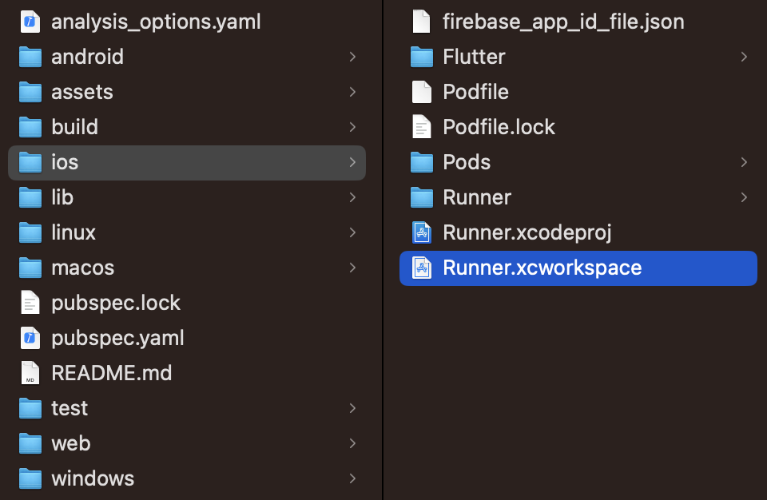
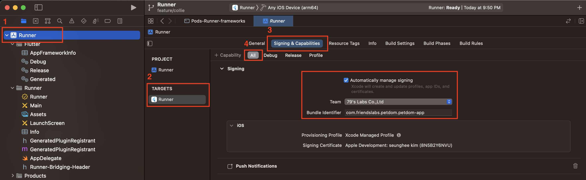
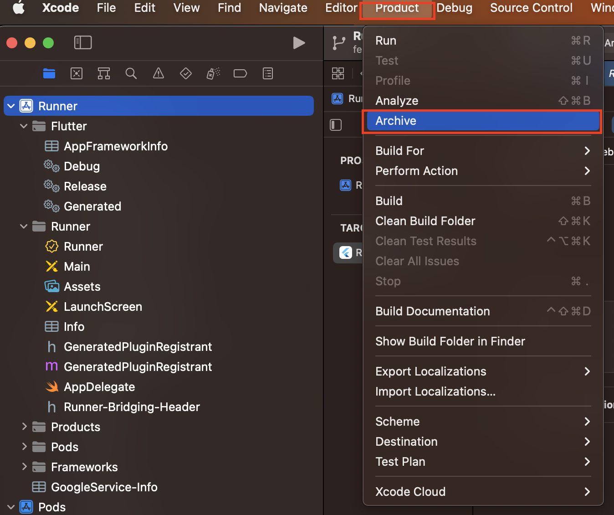
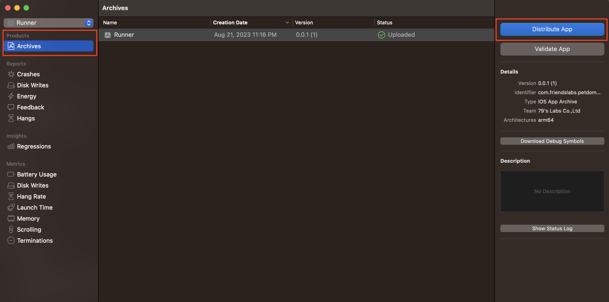
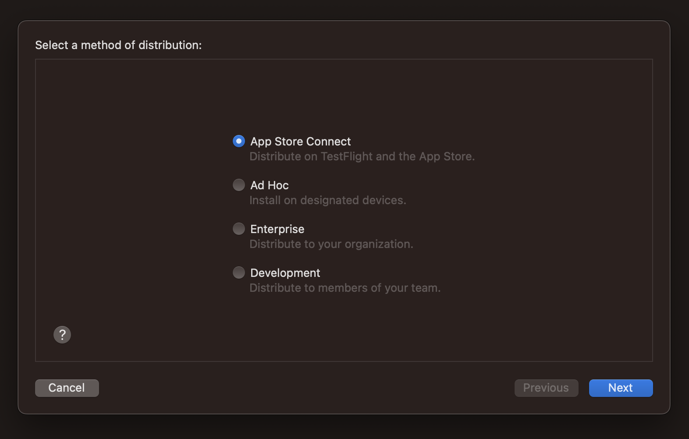
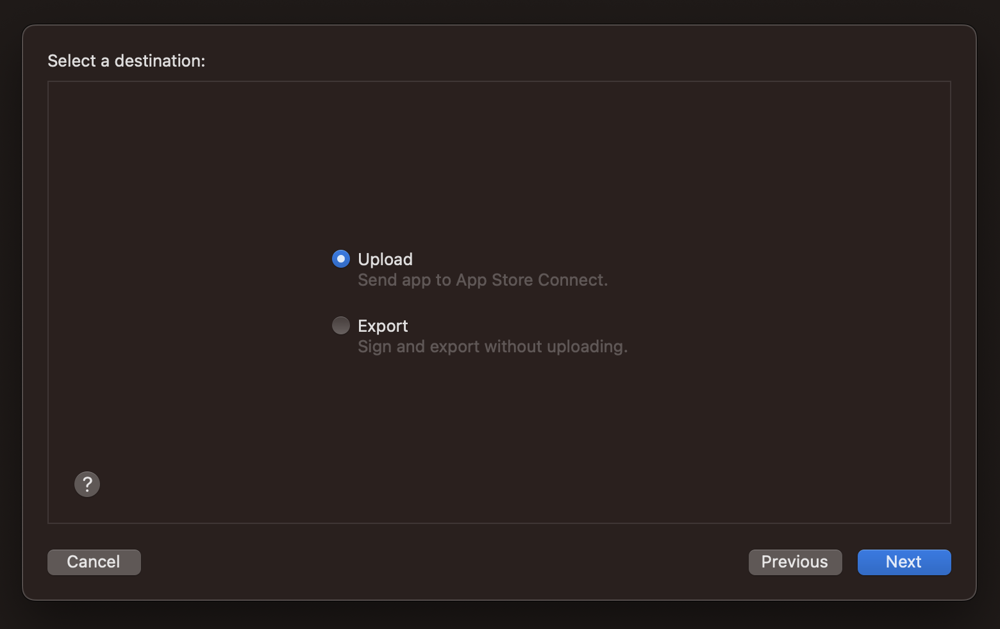
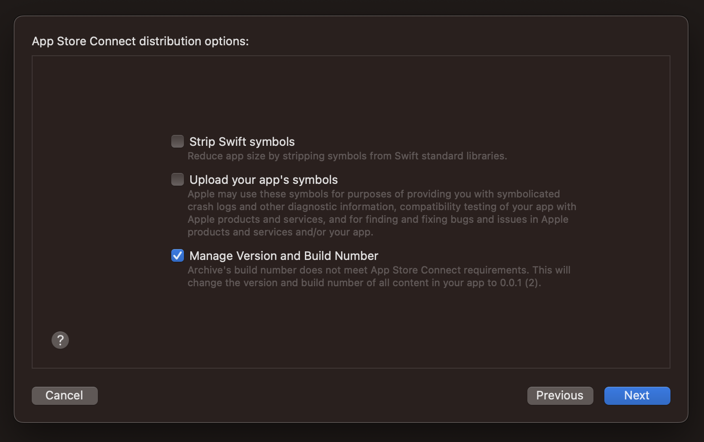
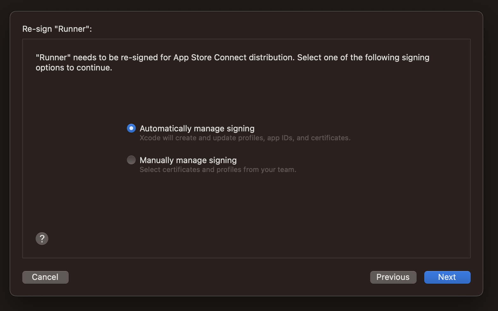

# firebase
    - push
# aws
    - mysql
    - s3
    - ec2
    - cloudfront
# google cloud plaform
    - map
# Json 
    - flutter pub run build_runner build --delete-conflicting-outputs
# Deploy for testflight (iOS)
### Step 1
프로젝트 디렉토리에서 ios의 `Runner.xcworkspace`를 실행시킵니다

### Step 2
이미지와 같이 인증서를 설정합니다

### Step 3
상단 메뉴에서 Product > Archive 를 실행 시킵니다

### Step 4
아카이브에 성공하면 아카이브를 선택하고 `Distribute App` 버튼을 눌러줍니다

### Step 5
아래 이미지와 같이 설정하여 배포를 진행하면 됩니다

#android apk 생성
flutter build apk --release --target-platform=android-arm64

#android SHA 인증서 생성(firebase 등록)
- debug
  keytool -list -v -keystore ~/.android/debug.keystore -alias androiddebugkey -storepass android -keypass android
- release (key.jks 가 있는 폴더에서)
  keytool -list -v -keystore key.jks